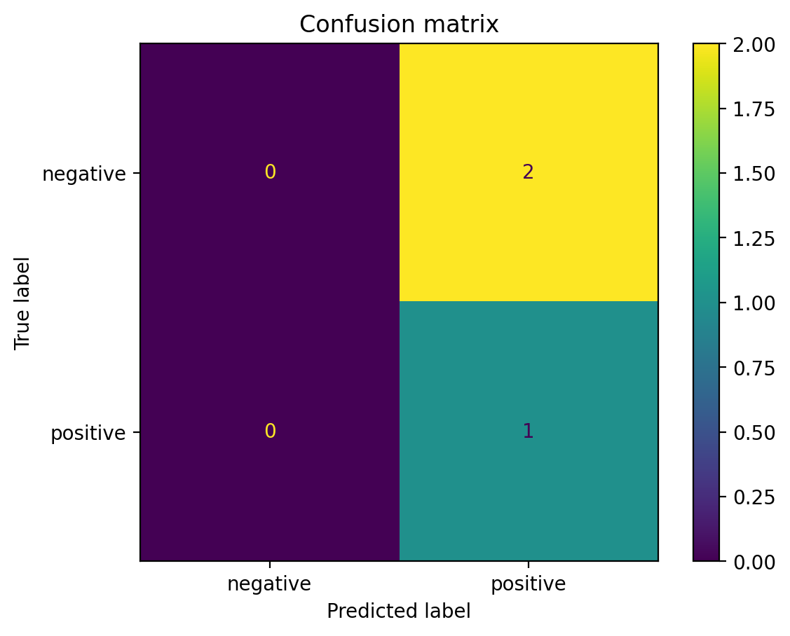

# Sentiment Classifier Baseline

Простой и понятный baseline-проект по анализу тональности текстов. 
Модель классифицирует тексты на категории:
- positive
- negative
- neutral

Проект подходит для:
- портфолио начинающего ML-инженера
- учебных целей
- экспериментов с текстовой классификацией
- быстрого прототипирования перед нейросетями

---

## Что делает проект

✔️ читает датасет с текстами  
✔️ преобразует тексты в TF-IDF признаки  
✔️ обучает модель Logistic Regression  
✔️ делит данные на train/test  
✔️ выводит метрики качества  
✔️ делает предсказания на примерах  
✔️ работает из коробки даже без файлов данных

---

## Требования

- Python 3.8+
- библиотеки из requirements.txt

---

## Как запустить

### Вариант 1 — ничего не настраивать

Просто запустить:

python3 src/main.py

Проект сам:
- создаст небольшой встроенный датасет
- обучит модель
- выведет accuracy и отчёт по классам
- покажет примеры предсказаний

---

### Вариант 2 — использовать свой CSV файл

Формат файла:

text,label  
Очень понравился сервис,positive  
Все было плохо,negative  
Нормально, но без восторга,neutral  

Запуск:

python3 src/main.py --data data.csv

---

## Пример вывода программы

[WARN] Файл с данными не найден. Использую демо-набор.  
[INFO] Обучаю модель...  
[RESULT] Accuracy: 1.0000  

[RESULT] Classification report:
precision / recall / f1-score показаны для каждого класса

## Confusion matrix

---

## Технологический стек

- Python
- scikit-learn
- TF-IDF vectorizer
- Logistic Regression
- train/test split
- metrics: accuracy, classification report

---

## Идеи для развития проекта

- заменить логистическую регрессию на нейросеть
- добавить LSTM/BERT
- добавить FastAPI API-интерфейс
- веб-интерфейс
- сохранение модели на диск
- обучение на большом датасете отзывов

---

## Лицензия

Проект создан в образовательных целях. Можно свободно использовать и модифицировать.
